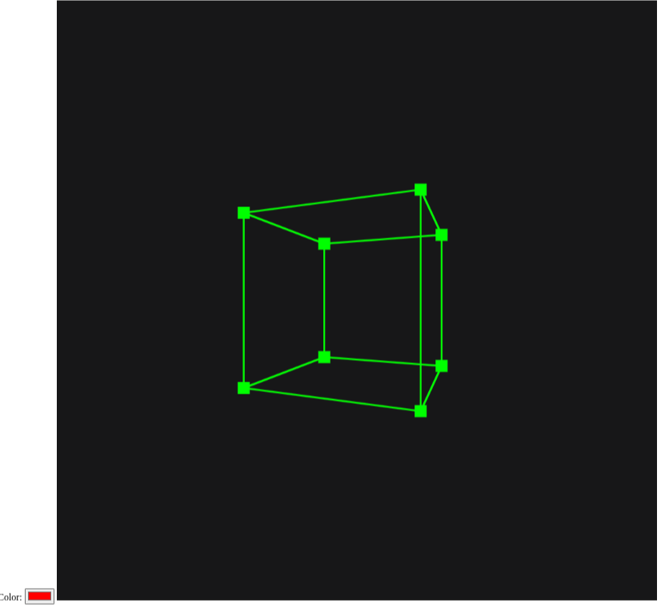

# Preview
- A simple website using HTML canvas to simulate a 3D cube
- The aim of the project is to learn about 3D objects and how they project on 2D
- learned about the formula (y'=y/z,x'=x/z) and vector rotations
- Made using simple HTML, JS stack
- The implementation involves drawing the points, then projecting them, then allowing them to rotate in the xz direction(i.e around the y axis)
- The project feature a color slider to change the color of the verticies and lines.
  
